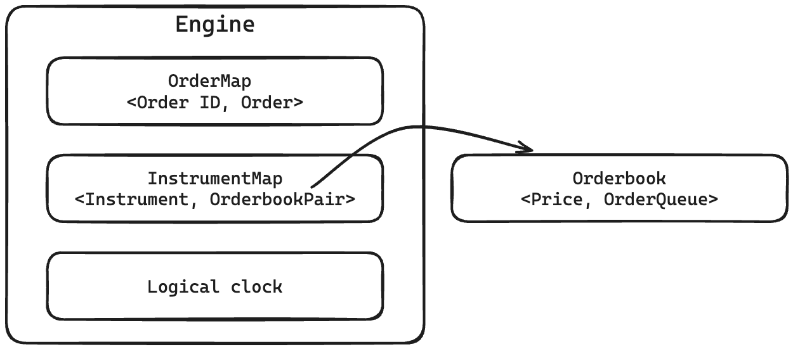

# C++ Matching Engine

- [Data structures used](#data-structures-used)
- [Synchronisation primives used](#synchronisation-primives-used)
- [Achieved level of concurrency](#achieved-level-of-concurrency)
  - [Concurrent orderbook access](#concurrent-orderbook-access)
  - [Serialising same-instrument matching](#serialising-same-instrument-matching)
  - [Concurrent cancellation and matching](#concurrent-cancellation-and-matching)
- [Testing methodology](#testing-methodology)

## Data structures used

| Class/Wrapper   | Underlying data structure       | Explanation                                                                                                                                                                                                                                                                                                    |
| --------------- | ------------------------------- | -------------------------------------------------------------------------------------------------------------------------------------------------------------------------------------------------------------------------------------------------------------------------------------------------------------- |
| `OrderMap`      | `unordered_map`, `shared_mutex` | Keeps track of all the resting orders that are in the engine                                                                                                                                                                                                                                                   |
| `InstrumentMap` | `shared_mutex`, `OrderbookPair` | Keeps track of existing instruments and their respective buy and sell orderbooks                                                                                                                                                                                                                               |
| `Orderbook`     | `map`, `shared_mutex`           | Maintains price-time priority for orders that cannot be fully-filled based on whether the orderbook is for a buy or sell, data is stored according to price level and the respective queue of orders for that price to ensure temporal correctness without needing to maintain a timestamp value on each order |
| `OrderQueue`    | `queue`                         | Basic FIFO queue functionality for resting orders                                                                                                                                                                                                                                                              |

> [!NOTE]
> In hindsight, `Orderbook` and `OrderQueue` could have been squashed into a `PriorityQueue`. `map` was used in an attempt to achieve a higher level of concurrency where start searching from different "levels" of the `Orderbook` but this approach did not pan out to anything.

## Synchronisation primives used

1. `unique_lock` - modify custom data structures and the Order struct
2. `shared_lock` - reading custom data structues in a non-blocking, starvation-free manner
3. `scoped_lock` - locking multiple mutexes in a deadlock-free manner
4. `atomic_uint32` - logical clock to make reading the output easier

## Achieved level of concurrency

Instrument level concurrency was acheved where orders for multiple instruments can execute concurrently and in parallel, but the order of executions for the same instrument is serialised. To achieve this the following had to be ensured.

### Concurrent orderbook access

This was achieved using a `shared_lock` to allow for concurrent reads and a `unique_lock` to exclusive acquire the underlying mutex before adding a new pair of order books into `InstrumentMap`. After acquiring a `shared_lock`, the function checks for whether an instrument, and its corresponding orderbooks, already exist. If so, it returns the instrument's order books. Otherwise, it releases the initial `shared_lock` before acuiring the `unique_lock`. It then checks to see if the instrument's order books already exist in the event that another thread might have added it first. Only when it once again confirms that the order books for the instrument do not exist does it add a new pair of orderbooks into the `InstrumentMap` before returning the newly-formed pair of orderbooks.

### Serialising same-instrument matching

Once the orderbook pair is retrieved, a `scoped_lock` is used on the underlying mutexes of the buy and sell books before calling the respective `match()` functions based on the current active order (e.g. match an active buy order against a sell order book). In the event where the active order has been fully filled, RAII helps to unlock the `scoped_lock` when returninig from the function. If the active order can no longer be matched but can still be filled (order was not filled or only partially filled), it gets added to its same-typed orderbook. The usage of the earlier `scoped_lock` ensures that while matching and insertion is happening, no other threads that are trying to service another active order for the same instrument can attempt to match or insert into the order books. This ensures that the current active order that is being serviced will always try to match with what has already been added to the order book from when it obtained the `scoped_lock`.

When orders are being executed or being added to an order book, the `fetch_add()` function of the logical clock is used to timestamp and validate the serialisation of events. Orders that cannot be fully matched will then be added to `OrderMap` whose mutex gets locked with a `unique_lock` before inserting the order.

### Concurrent cancellation and matching

When an order is cancelled, minimal blocking is achieved by ensuring that the order that is attempting to be canceled is owned exclusively by a single thread. This is achieved by acquiring a `unique_lock` for the order. If the cancelling function is waiting to acquire an order, it means that there is a thread that has acquired the order and is currently either (1) also trying to cancel it, or (2) trying to match in. In either case, once the cancelling function acquires the order exclusively, it checks that its `count` value is non-zero (order has not been fully-filled), and its status is not already cancelled before proceeding to cancel it by removing it from the `OrderMap` and marking the order as cancelled (lazy-cancellation).

The `match()` function is carried out when it exclusively acquires the order where it first checks that the order has not been marked as cancelled. If it is, it gets popped from the `OrderQueue` before attempting to match another resting order, if it exists.

## Testing methodology

A [python script](./scripts/randomtest.py) was used to randomly generate a test case from 10 instruments and 50 threads that begin all at once as a stress test. [`randomtest.sh`](./scripts/randomtest.sh) which accepts a single input (defaults to 10) that runs the python script and pipes it into the grader and the current engine which is built using “make all”. The bash script exits with an error code upon the first failing test and stores the failing test case in the [tests](./tests/) directory.

After fixing the issue, [`run_tests.sh`](./scripts/run_tests.sh), which runs the grader with the tests in the [tests](./tests/) directory, is used to verify that the issue is fixed. This script runs locally several times to best account for the different interleaving executions. These scripts are also once executed using Github Actions when a new commit is pushed with thread and address sanitisers ensuring no regressions were caused.

Before merging, the PR is labelled with `mergecheck` which runs [`randomtest.sh`](./scripts/randomtest.sh) 100 times as a sanity check before merging to the main branch. The workflow files for these Github Actions can be viewed in [`.github/workflows`](./.github/workflows/).
