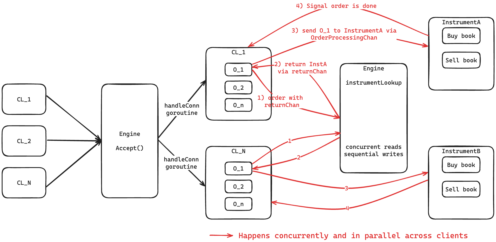

# Golang Matching Engine

- [Requirements](#requirements)
- [Project layout](#project-layout)
- [Data structures used](#data-structures-used)
- [Go patterns used](#go-patterns-used)
- [Concurrent execution from multiple, parallel clients](#concurrent-execution-from-multiple-parallel-clients)
- [Testing methodology](#testing-methodology)

## Requirements

1. `Go >= 1.22`
2. `Make`

## Project layout

```tree
.
├── cmd
│   ├── client
│   │   └── main.go             // Entrypoint for building `client` binary
│   └── engine
│       └── main.go             // Entrypoint for building `engine` binary
├── internal
│   └── pkg
│       ├── cio                 // Custom I/O for `client`-`engine` interaction
│       │   ├── cio.h           // Currently required to define fix-sized struct for binary encoding/decoding.
│       │   │                   // It may be possible to not require using C header files.
│       │   └── cio.go
│       │
│       │                       // Custom classes, each directory contains a single `go` file
│       ├── engine
│       ├── instrument
│       ├── lclock
│       ├── order
│       └── orderheap
├── Makefile                    // Compile `client` and `engine`
├── go.mod                      // Required by Go to treat this directory as a single project, must NOT contain external URLs
├── grader                      // Grader binary for Linux
├── grader_arm64-apple-darwin   // Grader binary for ARM-based MacOS
├── scripts                     // Scripts to (stress) test the `engine` using the respective grader binary
└── tests
```

## Data structures used

| Data structure | Description                                                                                                                                                                                                                                                                                                                                                                                                                                                                                                                                                                            |
| -------------- | -------------------------------------------------------------------------------------------------------------------------------------------------------------------------------------------------------------------------------------------------------------------------------------------------------------------------------------------------------------------------------------------------------------------------------------------------------------------------------------------------------------------------------------------------------------------------------------- |
| `Order`        | Created from the details of the input sent by the client as well as from the context of the negine to allow the instrument to signal to the client that the order is done processing                                                                                                                                                                                                                                                                                                                                                                                                   |
| `OrderHeap`    | Used to represent the instruments' buy and sell order books which store orders sorted by time-price, according to whether the order book is for a buy or sell                                                                                                                                                                                                                                                                                                                                                                                                                          |
| `Instrument`   | Creates an `OrderProcessingChannel` and spawns a goroutine for `serveProcessingChannel`. In this goroutine, the buy and sell order books are locally initialised before a for-select loop listens on the `OrderProcessingChannel` where buy and sell orders are matched with their opposite order books (e.g. buy order match against sell book), and cancel orders iterate over the associated book and remove the matching order if it exists                                                                                                                                        |
| `Engine`       | Creates a `lookupChannel` and spawns a goroutine for `serveLookupChannel`. In this goroutine, orders from clients are sent into this channel along with a `returnChannel`. In the said goroutine, a local `map` is initialised to associate instrument names to thei respective `Instrument` data structures. The goroutine reads the order and looks for a corresponding `Instrument` struct and returns it via the supplied `returnChannel`. If there is no matching instrument, a new one is created, stored in the map, and returnd to the client via the `returnChannel` as well. |

## Go patterns used

| Pattern         | Used for/in                                                                                                                                                                                                                                                                                                                           |
| --------------- | ------------------------------------------------------------------------------------------------------------------------------------------------------------------------------------------------------------------------------------------------------------------------------------------------------------------------------------- |
| Fan-in/out      | - `handleConn` goroutine spawans a unique goroutine for every new client that connects to the engine <br> - Load-balancing orders to their corresponding instruments to allow instrument-level concurrency                                                                                                                            |
| For-select loop | - Used in all goroutines that are constantly listening on an unbuffred channel and act on items that are sent to it (e.g. `serveLookupChannel`, `serveProcessingChannel`) <br> - Typically also listens on `ctx.Done()` which closes the channel that it is listening on and returns from the function to prevent leaking goroutines. |

## Concurrent execution from multiple, parallel clients



This diagram illustrates the temporal flow of events for better clarity, entities with the same name refers to the same entity (e.g. there is only a single instance of Engine). Building on the previous sections, instrument-level concurrency is achieved after the instrument lookup is done. Once the engine returns the current order’s corresponding instrument to the client via the “returnChannel”, the client sends the order to the instrument’s “OrderProcessingChannel” where orders are processed sequentially, but executed in parallel for different instruments. It is worth noting that the instrument lookup is sequential regardless of whether the instrument has already existed in the map or otherwise, but has minimal impact on the potential concurrency in the subsequent phases of the matching engine.

The client has to ensure that the current order is done processing to prevent subsequent orders from being completed before the current order is done processing so as to ensure the temporal correctness of orders being processed from a client. An example of how this may happen if the client processes orders concurrently is if the current order is large and goes through several partial fills, while a subsequent order is for a new instrument. Hence the client must only start processing the next order after the current order has signalled to the client that it is done processing via the order’s context.

The processing of orders can happen concurrently for multiple parallel clients so long as the orders of those clients are for different instruments.

## Testing methodology

Unit testing is done in [`orderheap_test.go`](./internal/pkg/orderheap/orderheap_test.go) to ensure the invariant of the buy and sell order books are not broken. The supplied basic tests to ensure correctness hold for an orderbook that only has 1 client connected to it.

A Go script [`randomtest.go`](./scripts/randomtest.go) was also created to generate tests with multiple clients by running `go run scripts/randomtest.go [--c <client_count>]`. The `--c` flag is an optional flag that can be used to generate a test case for the specified number of clients. This value defaults to 50 if not specified.

As we achieve higher levels of concurrency and want to ensure correctness, a bash script was created that pipes the output of the Go script into the grader and built engine and runs using `~/scripts/randomtest.sh [count]`, not specifying `count` would default the script to run against 10 random tests. The script fast-fails at the first failed test and stores the failed test in the [`tests`](./tests/) directory.

After fixing the issue, the following bash script is used to run all the tests we have previously failed (~/scripts/run_tests.sh) to ensure no regression was introduced. A [Github Action CI pipeline](./.github/workflows/ci.yml) was also created to stress-test the engine built with the race flag and running “~/scripts/randomtest.sh 100” with the default number of clients.
